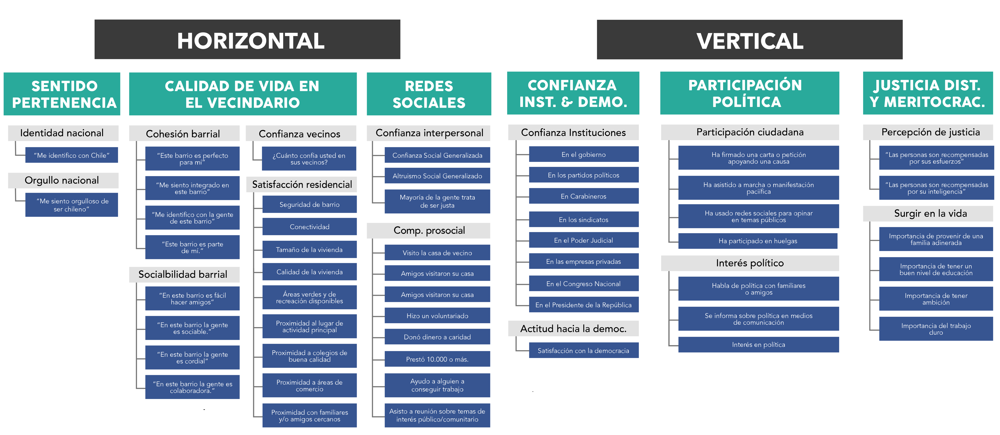

class: front

```{r eval=FALSE, include=FALSE}
# Correr esto para que funcione el infinite moonreader, el root folder debe ser static para si dirigir solo "bajndo" en directorios hacia el bib y otros

xaringan::inf_mr('/static/docpres/02_bases/2mlmbases.Rmd')

o en RStudio:
  - abrir desde carpeta root del proyecto
  - Addins-> infinite moon reader
```


```{r setup, include=FALSE, cache = FALSE}
require("knitr")
options(htmltools.dir.version = FALSE)
pacman::p_load(RefManageR)
# bib <- ReadBib("../../bib/electivomultinivel.bib", check = FALSE)
opts_chunk$set(warning=FALSE,
             message=FALSE,
             echo=FALSE,
             cache = FALSE, fig.width=7, fig.height=5.2)
pacman::p_load(flipbookr, tidyverse)
```


```{r xaringanExtra, include=FALSE}
xaringanExtra::use_xaringan_extra(c("tile_view", "animate_css"))
xaringanExtra::use_scribble()
```


<!---
Para correr en ATOM
- open terminal, abrir R (simplemente, R y enter)
- rmarkdown::render('static/docpres/07_interacciones/7interacciones.Rmd', 'xaringan::moon_reader')

About macros.js: permite escalar las imágenes como [scale 50%](path to image), hay si que grabar ese archivo js en el directorio.
--->


.pull-left[
# Metodología Cuantitativa Avanzada
## **Kevin Carrasco**
## **Daniela Olivares Collío**
## Sociología FACSO - UChile
## 1er Sem 2025
## [.green[metod2-mcs.netlify.com]](https://metod2-mcs.netlify.com)
] 
    

.pull-right[
.right[
<br>
## .yellow[Sesión 1: Introducción ]


]

]
---

layout: true
class: animated, fadeIn


---
class: inverse, bottom, right, animated, slideInRight


# .red[Sesión 1]
<br>


Introducción y bases de la investigación cuantitativa

Introducción a R y RStudio
<br>
<br>
<br>
<br>
---

# Introducción y bases de la investigación cuantitativa

* En la investigación cuantitativa se asume que hay una realidad "allá afuera" que quien investiga puede conocer a través de su **cuantificación**

--

* Permite lidiar con la **incertidumbre**

--

* Foco en la teoría (*generalmente* se enfatiza el **método hipotético-deductivo**, buscando probar hipótesis de teorías previamente estudiadas)

---

# Introducción y bases de la investigación cuantitativa

* Explicar lo que es, no lo que debería ser

--

* Conocer y explicar grupos de personas de manera general, no individuos por sí solos

---

# Proceso de investigación cuantitativo (D'Ancona 2001)

1. Formulación de un problema de investigación
2. Operacionalización del problema
  - Hipótesis
  - Operacionalización de conceptos teóricos
  - Delimitación de unidad de análisis
3. Diseño de la investigación: cómo se realizará la investigación (diseños transversales, longitudinales, experimentales)
4. Factibilidad de la investigación: Cronología de tareas; recursos disponibles (materiales y humanos); etc.

---

# Proceso de investigación cuantitativo (D'Ancona 2001)

1. Formulación de un problema de investigación
2. Operacionalización del problema
  - Hipótesis
  - .red[Operacionalización de conceptos teóricos]
  - Delimitación de unidad de análisis
3. Diseño de la investigación: cómo se realizará la investigación (diseños transversales, longitudinales, experimentales)
4. Factibilidad de la investigación: Cronología de tareas; recursos disponibles (materiales y humanos); etc.

---
class: roja, center, middle

# Medición y operacionalización

---

# Medición y operacionalización

- Operacionalización = "codificación" de un fenómeno con el fin de hacerlo **medible**

- Hay muchas formas de "codificar" un mismo concepto

- ¿Por qué es importante definir operacionalmente los conceptos?

---

# Medición y operacionalización

.center[¿Qué concepto se pretende medir con esta pregunta?]

.center[]

---

# Medición y operacionalización

.center[¿Y con estas preguntas?]

.center[]

---

# Medición y operacionalización

.center[y si quisiéramos medir un concepto más complejo?]

--

.center[¿cómo se puede medir cohesión social?]

---

# Medición y operacionalización

- Cohesión social según CEPAL (2021)

.center[]

---

# Medición y operacionalización

- Cohesión social según Observatorio de cohesión social (ocs-coes) (2020)

.center[]

---

# Medición y operacionalización

¿Por qué es importante definir operacionalmente los conceptos?

1. Claridad conceptual (clave para el testeo de hipótesis)

2. Control de "error de medición"
  - Inexactitudes derivadas de problemas con el instrumento de medición (instrumentos)
  - ¿Ejemplos? 
  
---

# Medición y operacionalización
  
3. Error de muestreo
  - Inexactitud en la elección de los casos
  - Problema de representatividad
  
---

.center[]

.small[fuente: [https://terceradosis.cl/2023/07/23/hoy-de-que-universo-me-esta-hablando-ojo-con-las-encuestas/](https://terceradosis.cl/2023/07/23/hoy-de-que-universo-me-esta-hablando-ojo-con-las-encuestas/)]

---

Al difundir la encuesta CADEM, CNN tituló de la siguiente forma

.center[86% cree que Caso Convenios es **"corrupción"**]

--

.red[.center[Sin embargo, hay un problema]]

--

.center[]

---

.center[]

---

.red[.center[Otro problema: la no respuesta]]

--

.center[]

---

.center[]

---
class: roja, center, middle

# Introducción y bases de la investigación cuantitativa:

## Datos y Variables

---
## Datos y variables

* Los datos miden al menos una *característica* de a los menos una *unidad*  en a lo menos *un punto en el tiempo*

--
 + Ejemplo: La esperanza de vida en Chile el 2017 fue de 79,9 años

   - Característica (variable) : esperanza de vida

   - Unidad: Años

   - Punto en el tiempo: 2017

---
## Datos y variables

* Base de Datos

* Forma "rectangular" de almacenamiento de datos:

.center[]

---
## Datos y variables

  - cada .blue[fila] representa una unidad o caso (ej: un entrevistad_)

  - cada .orange[columna] una variable (ej: edad)

  - cada .purple[variable] posee valores numéricos

  - los valores numéricos pueden estar asociados a una etiqueta (ej: 1=Mujer)
  
---
##.yellow[Datos] y variables

### Ejemplos de estudios / bases de datos

1. [Encuesta Centro de Estudios Públicos](https://www.cepchile.cl/cep/site/edic/base/port/encuestacep.html)

2. [Encuesta CASEN](http://observatorio.ministeriodesarrollosocial.gob.cl/casen-multidimensional/casen/casen_2017.php)

3. [Encuesta Lapop](https://www.vanderbilt.edu/lapop-espanol/)

4. [ELSOC](https://coes.cl/encuesta-panel/)

---
## Datos y variables

- Una variable representa cualquier cosa o propiedad que varia y a la cuál se le asigna un valor. Es decir:

- $Variable \neq Constante$

- Pueden ser visibles o no visibles/latentes. (Ej: peso / inteligencia)

---
## Datos y variables

- discretas (Rango finito de valores):

      - Dicotómicas
      - Politómicas

- continuas:

      - Rango (teóricamente) infinito de valores.

---
## Escalas de medición de variables

- NOIR: Nominal, Ordinal, Intervalar, Razón

.small[
| Tipo       	| Características                     	        | Propiedad de números 	| Ejemplo|
|------------	|----------------------------------------------|---------------	|-----------	|
| *Nominal*    	| Uso de números en lugar de palabras 	| Identidad            	| Nacionalidad      	|
| *Ordinal*    	| Números se usan para ordenar series 	| + ranking            	| Nivel educacional 	|
| *Intervalar* 	| Intervalos iguales entre números    	| + igualdad           	| Temperatura       	|
| *Razón*      	| Cero real                           	| + aditividad         	| Distancia         	|
]

---
class: inverse, bottom, right, animated, slideInRight


# .red[Sesión 1]
<br>


Introducción y bases de la investigación cuantitativa

Introducción a R y RStudio
<br>
<br>
<br>
<br>
---
## Introducción a R y RStudio

.pull-left[

]

.pull-right[

]

---


.center[

]

.small[.right[fuente: [Guía de campo de R](http://wiki.imbiv.unc.edu.ar/index.php/Gu%C3%ADa_de_campo_de_R)]
]

---
## Introducción a R y RStudio

Vuelta a la página


# .center[[**metod1-mcs.netlify.app/resource/01-resource.html**](https://metod1-mcs.netlify.app/resource/01-resource.html)]

---


class: front

.pull-left[
# Metodología I
## **Kevin Carrasco**
## **Daniela Olivares Collío**
## Sociología FACSO - UChile
## 1er Sem 2025
## [.green[metod1-mcs.netlify.com]](https://metod1-mcs.netlify.com)
] 
    

.pull-right[
.right[
<br>
## .yellow[Sesión 1: Introducción ]


]

]
