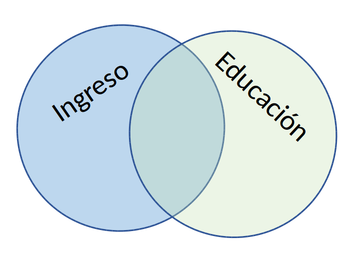
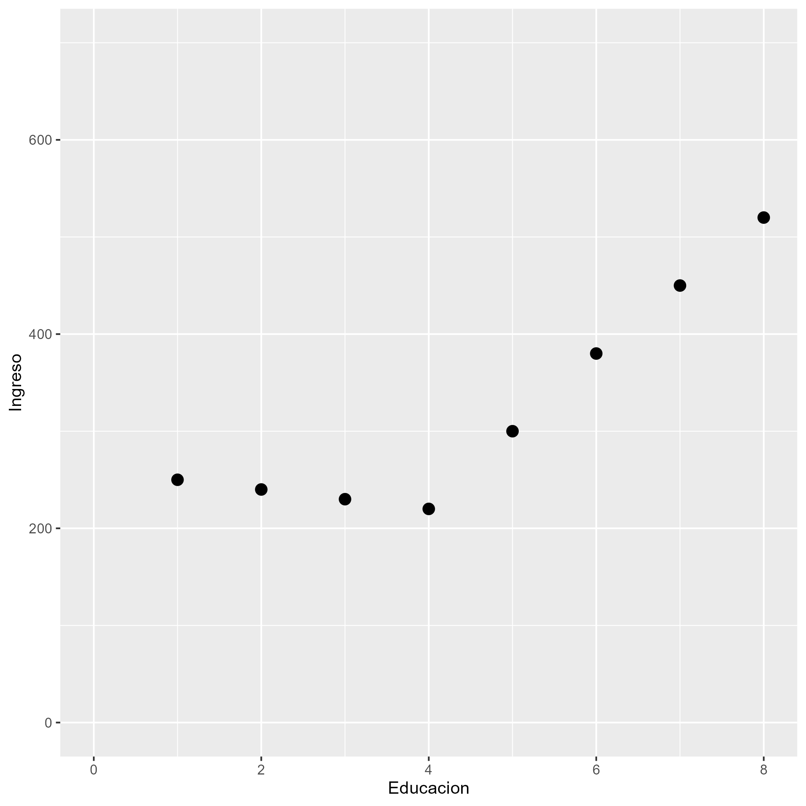
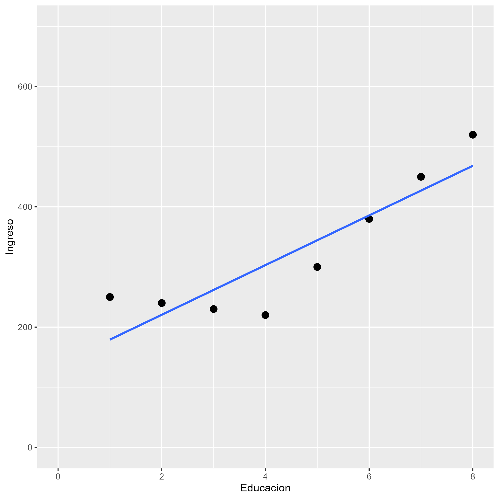

class: front


```{r eval=FALSE, include=FALSE}
# Correr esto para que funcione el infinite moonreader, el root folder debe ser static para si dirigir solo "bajndo" en directorios hacia el bib y otros

xaringan::inf_mr('/static/docpres/02_bases/2mlmbases.Rmd')

o en RStudio:
  - abrir desde carpeta root del proyecto
  - Addins-> infinite moon reader
```


```{r setup, include=FALSE, cache = FALSE}
require("knitr")
options(htmltools.dir.version = FALSE)
pacman::p_load(RefManageR)
# bib <- ReadBib("../../bib/electivomultinivel.bib", check = FALSE)
opts_chunk$set(warning=FALSE,
             message=FALSE,
             echo=FALSE,
             cache = FALSE #,fig.width=7, fig.height=5.2
             )
pacman::p_load(flipbookr, tidyverse)
```


```{r xaringanExtra, include=FALSE}
xaringanExtra::use_xaringan_extra(c("tile_view", "animate_css"))
xaringanExtra::use_scribble()
```

<!---
Para correr en ATOM
- open terminal, abrir R (simplemente, R y enter)
- rmarkdown::render('static/docpres/07_interacciones/7interacciones.Rmd', 'xaringan::moon_reader')

About macros.js: permite escalar las imágenes como [scale 50%](path to image), hay si que grabar ese archivo js en el directorio.
--->


.pull-left[
## Metodología Cuantitativa Avanzada
## **Kevin Carrasco**
## Magíster en ciencias sociales - Universidad de Chile
## 1er Sem 2025
## [.green[metod2-mcs.netlify.com]](https://metod2-mcs.netlify.com)
] 


.pull-right[
.right[
<br>
## .yellow[Sesión 7: Regresión lineal]


]

]
---
class: inverse, bottom, right


# .red[Sesión 7]
<br>

.yellow[Punto de partida]

Regresión lineal

R2

Inferencia

<br>
<br>
<br>
<br>
---

layout: true
class: animated, fadeIn

---
# Asociación: covarianza / correlación

.pull-left[
  _¿Se relaciona la variación de una variable, con la variación de otra variable?_
]
.pull-right[
.center[]
]

---
# Correlación

- Medida de co-variación lineal estandarizada

--

<br>
<br>
.center[¿En qué rango varía una correlación?]

--

- Varía entre -1 y +1

--

- Gráficamente se expresa en *nubes de puntos*

---

.center[]

---

.pull-left[* Pero ojo, 
**correlación no implica causalidad**]


.pull-right[]

---
class: inverse, bottom, right


# .red[Sesión 7]
<br>

Punto de partida

.yellow[Regresión lineal]

R2

Inferencia

<br>
<br>
<br>
<br>
---

## ¿Qué es la regresión lineal?

--

* Es un modelo estadístico

--

- Se usa para:

  - **Conocer**: La relación de una variable dependiente de acuerdo a una/otras independiente(s)
  - **Predecir**: Estimar el valor de una variable dependiente de acuerdo al valor de otras
  - **Inferir**: si estas relaciones son estadísticamente significativas

---
## ¿Qué es la regresión lineal?

* Dos tipos de regresión:
  - Regresión lineal simple (una variable independiente)
  - Regresión lineal múltimple (más de una variable independiente)

---
## ¿Qué es la regresión lineal

.pull-left-narrow[
### Terminología:
]

.pull-right-wide[]

---
```{r echo=FALSE}
data <- cbind(Educacion=c(1,2,3,4,5,6,7,8),
              Ingreso=c(250,200,250,300,400,350,400,350))
data <- as.data.frame(data)
```


.pull-left-narrow[
### Ejemplo ]

.pull-right-wide[
```{r}
data
```

]

---
.pull-left-narrow[
### Ejemplo ]

.pull-right-wide[
```{r echo=FALSE}
plot1<- ggplot2::ggplot(data, aes(x=Educacion, y=Ingreso))+
  geom_point(size=3)+
  scale_x_continuous(breaks = seq(0, 8, by = 1)) +
  scale_y_continuous(breaks = seq(0, 700, by = 100))+
  ylim(0,700)+
  xlim(0,8)

ggsave(plot1, file="../../files/img/plot1.png")
```

.pull-right-wide[]

]


---

.pull-left-narrow[
### Ejemplo ]

.pull-right-wide[
```{r warning=FALSE, message=FALSE}
plot2<- ggplot2::ggplot(data, aes(x=Educacion, y=Ingreso))+
  geom_point(size=3)+
  geom_smooth(method = "lm", se=FALSE)+
  scale_x_continuous(breaks = seq(0, 8, by = 1)) +
  scale_y_continuous(breaks = seq(0, 700, by = 100))+
  ylim(0,700)+
  xlim(0,8)

ggsave(plot2, file="../../files/img/plot2.png")
```

.pull-right-wide[]
]

---

### La recta de regresión


$$\widehat{Y}=b_{0} +b_{1}X$$

.small[
Donde

- $\widehat{Y}$ es el valor estimado de $Y$ (que se puede predecir)

- $b_{0}$ es el intercepto de la recta 
  - el valor de Y cuando X es 0
  - Debido a que es una estimación, es común que sea un valor sin sentido analítico (incluso negativo)

- $b_{1}$ es el coeficiente de regresión (pendiente de la recta), que nos dice cuánto aumenta Y por cada punto que aumenta X

]
---
# Estimación de los coeficientes de la ecuación:

$$b_{1}=\frac{Cov(XY)}{VarX}$$

$$b_{1}=\frac{\frac{\sum_{i=1}^{n}(x_i - \bar{x})(y_i - \bar{y})} {n-1}}{\frac{\sum_{i=1}^{n}(x_i - \bar{x})(x_i - \bar{x})} {n-1}}$$

Y simplificando

$$b_{1}=\frac{\sum_{i=1}^{n}(x_i - \bar{x})(y_i - \bar{y})} {\sum_{i=1}^{n}(x_i - \bar{x})(x_i - \bar{x})}$$

--

- Basicamente, un análisis de variación conjunta de X e Y


---

### Cálculo de coeficiente de regresión
.small[

| Caso    | X (años educación)  | Y (nivel de ingresos)    | X - X̄ | Y - Ȳ  | (X - X̄) * (Y - Ȳ) |  (X - X̄)² |
|---------|---------------------|--------------------------|--------|--------|--------------------|------------|
| Caso 1  | 1                   | 250                      |    |   |              |     |
| Caso 2  | 2                   | 200                      |    |  |              |        |
| Caso 3  | 3                   | 250                      |    |   |              |        |
| Caso 4  | 4                   | 300                      |    |   |               |        |
| Caso 5  | 5                   | 400                      |    |    |               |        |
| Caso 6  | 6                   | 350                      |     |   |               |        |
| Caso 7  | 7                   | 400                      |     |    |              |        |
| Caso 8  | 8                   | 350                      |     |    |              |       |
| **Promedios / Sumas** | **X̄ = **| **Ȳ = **      |        |        | **Σ = **       | **Σ = ** |

]

---

### Cálculo de coeficiente de regresión
.small[

| Caso    | X (años educación)  | Y (nivel de ingresos)    | X - X̄ | Y - Ȳ  | (X - X̄) * (Y - Ȳ) |  (X - X̄)² |
|---------|---------------------|--------------------------|--------|--------|--------------------|------------|
| Caso 1  | 1                   | 250                      | -3.5   | -62.5  | 218.75             | 12.25      |
| Caso 2  | 2                   | 200                      | -2.5   | -112.5 | 281.25             | 6.25       |
| Caso 3  | 3                   | 250                      | -1.5   | -62.5  | 93.75              | 2.25       |
| Caso 4  | 4                   | 300                      | -0.5   | -12.5  | 6.25               | 0.25       |
| Caso 5  | 5                   | 400                      | 0.5    | 87.5   | 43.75              | 0.25       |
| Caso 6  | 6                   | 350                      | 1.5    | 37.5   | 56.25              | 2.25       |
| Caso 7  | 7                   | 400                      | 2.5    | 87.5   | 218.75             | 6.25       |
| Caso 8  | 8                   | 350                      | 3.5    | 37.5   | 131.25             | 12.25      |
| **Promedios / Sumas** | **X̄ = 4.5**| **Ȳ = 312.5**      |        |        | **Σ = 1050**       | **Σ = 42** |

]
---

### Cálculo de coeficiente de regresión

$$b_{1}=\frac{\sum_{i=1}^{n}(x_i - \bar{x})(y_i - \bar{y})} {\sum_{i=1}^{n}(x_i - \bar{x})(x_i - \bar{x})}=\frac{1050} {42}=25$$

---
### Estimación de los coeficientes de la ecuación:

$$\bar{Y}=b_{0}+b_{1}\bar{X}$$
Reemplazando:

$$\bar{Y}=b_{0}+25\bar{X}$$

Despejando el valor de $b_{0}$

$$b_{0}=312.5-25*4.5=200$$
  - Una propiedad de la recta de regresión es que siempre pasa por las coordenadas X̄Ȳ. Esto es, pasa por los valores promedios de X e Y 
---

.pull-left-narrow[
### Ejemplo 


*Por cada unidad que aumenta educación, ingreso aumenta en 25 unidades*
]

.pull-right-wide[
```{r warning=FALSE, message=FALSE}
ggplot2::ggplot(data, aes(x=Educacion, y=Ingreso))+
  geom_point(size=3)+
  geom_smooth(method = "lm", se=FALSE)+
  scale_x_continuous(breaks = seq(0, 8, by = 1)) +
  scale_y_continuous(breaks = seq(0, 700, by = 100))+
  ylim(0,700)+
  xlim(0,8)
```

.pull-right-wide[]
]

---
class: inverse, bottom, right

# .red[Sesión 7]
<br>

Punto de partida

Regresión lineal

.yellow[R2]

Inferencia

<br>
<br>
<br>
<br>
---
## Varianza explicada

- ¿Qué porcentaje de la varianza de Y logramos explicar con X?

--

* .red[R2] = Porcentaje de la variación de Y puede ser asociado a la variación de X

---

.pull-left-narrow[
### Ejemplo 


El ajuste del modelo a los datos se relaciona con la proporción de residuos generados por el modelo respecto de la varianza total de Y (R2)
]

.pull-right-wide[
```{r warning=FALSE, message=FALSE}
ggplot2::ggplot(data, aes(x=Educacion, y=Ingreso))+
  geom_point(size=3)+
  geom_smooth(method = "lm", se=FALSE)+
  scale_x_continuous(breaks = seq(0, 8, by = 1)) +
  scale_y_continuous(breaks = seq(0, 700, by = 100))+
  ylim(0,700)+
  xlim(0,8)
```

.pull-right-wide[]
]


---
class: inverse, bottom, right

# .red[Sesión 7]
<br>

Punto de partida

Regresión lineal

R2

.yellow[Inferencia]

<br>
<br>
<br>
<br>

---

## Inferencia estadística

* ¿Cómo sabemos si $b_{1}$ es estadísticamente significativo?

--

* ¿Nuestros datos se pueden extrapolar a la población?

---

## Inferencia estadística

- Según criterios muestrales:
  * Distribución normal
  * Desviación estándar
  
- Error estándar

---

### Ejemplo tabla de regresión

```{r}
reg1<-lm(Ingreso~Educacion, data=data)
```

```{r results='asis'}
texreg::htmlreg(reg1, caption="")
```

---

## Regresión múltiple

- Ahora el efecto de una variable X (expresado en el coeficiente de regresión) se interpreta de modo similar a una **correlación parcial** - es decir, **manteniendo controladas las otras variables del modelo**.

- Formas comunes de interpretar esto:

  - El impacto de X sobre Y, **manteniendo constante el efecto de las otras variables**, es de...
  - *Ceteris paribus*, la relación entre X e Y es...
  - El efecto **neto** de X sobre Y es de...


---

## Parcialización

.center[]

---


### Regresión múltiple

```{r echo=FALSE}
data <- as.data.frame(cbind(data,
              edad=c(25,20,20,30,45,30,45,40)))
```


```{r results='asis'}
reg2 <- lm(Ingreso~Educacion+edad, data = data)
texreg::htmlreg(reg2, caption="")
```

---

class: front

.pull-left[
## Metodología Cuantitativa Avanzada
## **Kevin Carrasco**
## Magíster en ciencias sociales - Universidad de Chile
## 1er Sem 2025
## [.green[metod2-mcs.netlify.com]](https://metod2-mcs.netlify.com)
] 


.pull-right[
.right[
<br>
## .yellow[Sesión 7: Regresión lineal]


]

]

