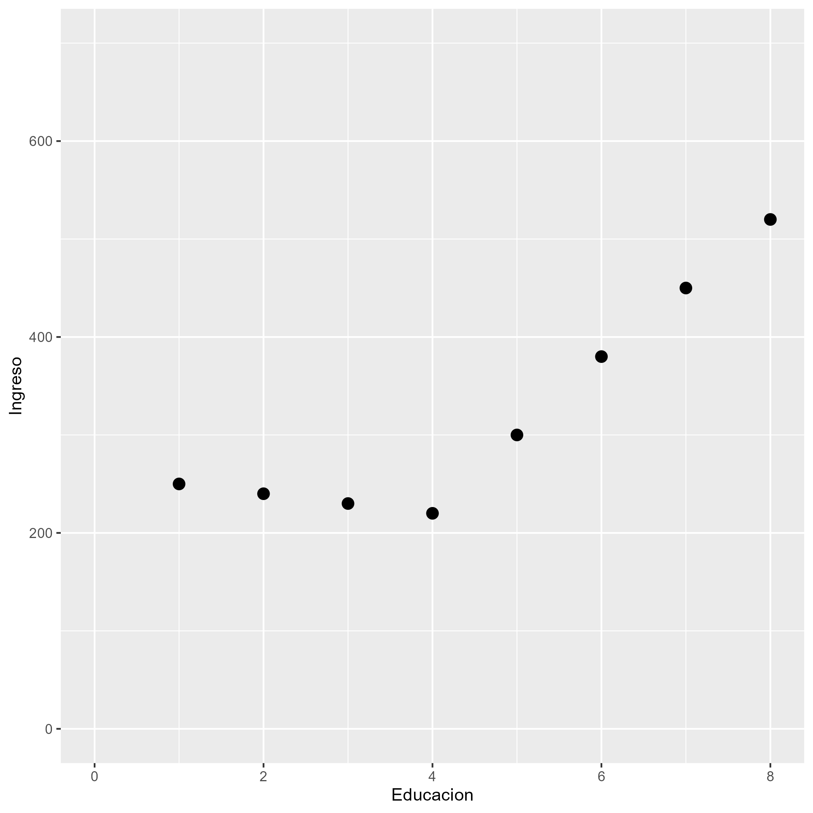

class: front


```{r eval=FALSE, include=FALSE}
# Correr esto para que funcione el infinite moonreader, el root folder debe ser static para si dirigir solo "bajndo" en directorios hacia el bib y otros

xaringan::inf_mr('/static/docpres/02_bases/2mlmbases.Rmd')

o en RStudio:
  - abrir desde carpeta root del proyecto
  - Addins-> infinite moon reader
```


```{r setup, include=FALSE, cache = FALSE}
require("knitr")
options(htmltools.dir.version = FALSE)
pacman::p_load(RefManageR)
# bib <- ReadBib("../../bib/electivomultinivel.bib", check = FALSE)
opts_chunk$set(warning=FALSE,
             message=FALSE,
             echo=FALSE,
             cache = FALSE #,fig.width=7, fig.height=5.2
             )
pacman::p_load(flipbookr, tidyverse)
```


```{r xaringanExtra, include=FALSE}
xaringanExtra::use_xaringan_extra(c("tile_view", "animate_css"))
xaringanExtra::use_scribble()
```

<!---
Para correr en ATOM
- open terminal, abrir R (simplemente, R y enter)
- rmarkdown::render('static/docpres/07_interacciones/7interacciones.Rmd', 'xaringan::moon_reader')

About macros.js: permite escalar las imágenes como [scale 50%](path to image), hay si que grabar ese archivo js en el directorio.
--->


.pull-left[
## Metodología Cuantitativa Avanzada
## **Kevin Carrasco**
## Magíster en ciencias sociales - Universidad de Chile
## 1er Sem 2025
## [.green[metod2-mcs.netlify.com]](https://metod2-mcs.netlify.com)
] 


.pull-right[
.right[
<br>
## .yellow[Sesión 8: Regresión lineal II]


]

]
---
class: inverse, bottom, right


# .red[Sesión 8]
<br>

.yellow[Repaso sesión anterior]

Valores predichos

Interacciones

<br>
<br>
<br>
<br>
---

layout: true
class: animated, fadeIn

---
# Asociación: covarianza / correlación

.pull-left[
  _¿Se relaciona la variación de una variable, con la variación de otra variable?_
]
.pull-right[
.center[]
]

---
.pull-left[* Pero ojo, 
**correlación no implica causalidad**]


.pull-right[]

---

## ¿Qué es la regresión lineal?

--

* Es un modelo estadístico que se usa para:

  - **Conocer**: La relación de una variable dependiente de acuerdo a una/otras independiente(s)
  - **Predecir**: Estimar el valor de una variable dependiente de acuerdo al valor de otras
  - **Inferir**: si estas relaciones son estadísticamente significativas

---
## ¿Qué es la regresión lineal?

* Dos tipos de regresión lineal:
  - Regresión lineal simple (una variable independiente)
  - Regresión lineal múltiple (más de una variable independiente)

---
```{r echo=FALSE}
data <- cbind(Educacion=c(1,2,3,4,5,6,7,8),
              Ingreso=c(250,240,230,220,300,380,450,520))
data <- as.data.frame(data)
```


.pull-left-narrow[
### Ejemplo ]

.pull-right-wide[
```{r}
data
```

]

---
.pull-left-narrow[
### Ejemplo ]

.pull-right-wide[
```{r echo=FALSE}
plot1<- ggplot2::ggplot(data, aes(x=Educacion, y=Ingreso))+
  geom_point(size=3)+
  scale_x_continuous(breaks = seq(0, 8, by = 1)) +
  scale_y_continuous(breaks = seq(0, 700, by = 100))+
  ylim(0,700)+
  xlim(0,8)

ggsave(plot1, file="../../files/img/plot1.png")
```

.pull-right-wide[]

]


---

.pull-left-narrow[
### Ejemplo ]

.pull-right-wide[
```{r warning=FALSE, message=FALSE}
plot2<- ggplot2::ggplot(data, aes(x=Educacion, y=Ingreso))+
  geom_point(size=3)+
  geom_smooth(method = "lm", se=FALSE)+
  scale_x_continuous(breaks = seq(0, 8, by = 1)) +
  scale_y_continuous(breaks = seq(0, 700, by = 100))+
  ylim(0,700)+
  xlim(0,8)

ggsave(plot2, file="../../files/img/plot2.png")
```

.pull-right-wide[]
]

---

### La recta de regresión


$$\widehat{Y}=b_{0} +b_{1}X$$

.small[
Donde

- $\widehat{Y}$ es el valor estimado de $Y$ (que se puede predecir)

- $b_{0}$ es el intercepto de la recta 
  - el valor de Y cuando X es 0
  - Debido a que es una estimación, es común que sea un valor sin sentido analítico (incluso negativo)

- $b_{1}$ es el coeficiente de regresión (pendiente de la recta), que nos dice cuánto aumenta Y por cada punto que aumenta X

]
---
# Estimación de los coeficientes de la ecuación:

$$b_{1}=\frac{Cov(XY)}{VarX}$$

$$b_{1}=\frac{\frac{\sum_{i=1}^{n}(x_i - \bar{x})(y_i - \bar{y})} {n-1}}{\frac{\sum_{i=1}^{n}(x_i - \bar{x})(x_i - \bar{x})} {n-1}}$$

Y simplificando

$$b_{1}=\frac{\sum_{i=1}^{n}(x_i - \bar{x})(y_i - \bar{y})} {\sum_{i=1}^{n}(x_i - \bar{x})(x_i - \bar{x})}$$

--

- Basicamente, un análisis de variación conjunta de X e Y


---
### Estimación de los coeficientes de la ecuación:

$$\bar{Y}=b_{0}+b_{1}\bar{X}$$
Reemplazando:

$$\bar{Y}=b_{0}+25\bar{X}$$

Despejando el valor de $b_{0}$

$$b_{0}=200-0\bar{X}$$
---

.pull-left-narrow[
### Ejemplo 


*Por cada unidad que aumenta educación, ingreso aumenta en 25 unidades*
]

.pull-right-wide[
]

---
## Varianza explicada

- ¿Qué porcentaje de la varianza de Y logramos explicar con X?

--

* .red[R2] = Porcentaje de la variación de Y puede ser asociado a la variación de X

---

.pull-left-narrow[
### Ejemplo 


El ajuste del modelo a los datos se relaciona con la proporción de residuos generados por el modelo respecto de la varianza total de Y (R2)
]

.pull-right-wide[
]

---

## Inferencia estadística

* ¿Cómo sabemos si $b_{1}$ es estadísticamente significativo?

--

* ¿Nuestros datos se pueden extrapolar a la población?

---

## Inferencia estadística

- Según criterios muestrales:
  * Distribución normal
  * Desviación estándar
  
- Error estándar

---

```{r}
reg1<-lm(Ingreso~Educacion, data=data)
```

```{r results='asis'}
texreg::knitreg(reg1, caption="")
```

---

```{r echo=FALSE}
data <- cbind(data,
              edad = c(25, 40, 20, 30, 25, 35, 45, 55))

reg2 <- lm(Ingreso~Educacion+edad, data = data)
```


```{r results='asis'}

texreg::knitreg(reg2, caption="")
```

---

## Parcialización

.center[]

---
```{r echo=FALSE}
data <- as.data.frame(cbind(data,
              Educacion_rec=c("Basica","Basica","Media","Media","Superior","Superior","Superior","Superior")))
reg3 <-lm(Ingreso~Educacion_rec, data=data)
```

¿y la interpretación para variables categóricas?

.pull-left[
.small[
```{r results='asis'}
texreg::knitreg(reg3, caption="",
                custom.coef.names = c("Intercepto",
                                     "Educación media",
                                     "Educación superior"))
```
]
]
--
.pull-right[
*Las personas que tienen educación superior ganan $167.5mil más en comparación con quienes tienen educación básica, efecto que es estadísticamente significativo (p<0.05)*

]

---
class: inverse, bottom, right

# .red[Sesión 8]
<br>

Repaso sesión anterior

.yellow[Valores predichos]

Interacciones

<br>
<br>
<br>
<br>

---
¿Cómo podemos predecir el valor esperado de una variable para una persona en particular?

.pull-left-narrow[
.small[
```{r results='asis'}
texreg::htmlreg(reg3, caption="",
                custom.coef.names = c("Intercepto",
                                     "Educación media",
                                     "Educación superior"))
```
]
]

.pull-right-wide[
$$\bar{Y}=b_{0}+b_{1}\bar{X}$$

Reemplazando:

$$\bar{Y}=245+b_{1}\bar{X}$$

¿Si una persona tuviera un nivel de educación superior?

$$\bar{Y}=245+167.5$$
$$\bar{Y}=412.5$$
]

---
.pull-left-narrow[
## Graficando
]

```{r}
plot3 <- ggeffects::ggpredict(reg3, terms = c("Educacion_rec")) %>%
  ggplot(aes(x=x, y=predicted)) +
  geom_bar(stat="identity", color="grey", fill="grey")+
  geom_errorbar(aes(ymin = conf.low, ymax = conf.high), width=.1) +
  labs(title="Educación", x = "", y = "") +
  theme_bw()

ggsave(plot3, file="../../files/img/plot3.png")

```

.pull-right-wide[


]

---
## Variables numéricas

```{r results='asis'}
reg4 <- lm(Ingreso~edad, data = data)
texreg::htmlreg(reg4, caption="")
```

---
.pull-left[
```{r}
plot4 <- ggeffects::ggpredict(reg2, terms="edad") %>%
  ggplot(mapping=aes(x = x, y=predicted)) +
  labs(title="Edad", x = "", y = "")+
  theme_bw() +
  geom_smooth()+
  geom_ribbon(aes(ymin = conf.low, ymax = conf.high), alpha = .2, fill = "black")

ggsave(plot4, file="../../files/img/plot4.png")
```


]


.pull-right[
$$\bar{Y}=b_{0}+b_{1}\bar{X}$$

Reemplazando:

$$\bar{Y}=52.51+b_{1}*7.89$$

¿Una persona de edad 40?

$$\bar{Y}=52.51+40*7.89$$
$$\bar{Y}=368.11$$
]

---

class: inverse, bottom, right

# .red[Sesión 8]
<br>

Repaso sesión anterior

Valores predichos

.yellow[Interacciones]

<br>
<br>
<br>
<br>

---
## Interacciones

- Útil para analizar en qué medida el efecto de una variable (ej. edad) sobre otra (ingresos) *cambia* al interactuar con otra variable (ej. Educación superior).

  - Efectos de interacción también llamados efectos de moderación
  - En este caso, Educación sería variable "moderadora"
  
- Matemáticamente: un efecto de interacción es resultado de una multiplicación entre dos variables

---
## Interacciones

- **Hipótesis**: En las personas con educación superior, el impacto de la edad sobre los ingresos será mayor

--

- Se busca, por tanto, evaluar la interacción entre
  
  Edad * Educación


---

.pull-left[
.small[
```{r results='asis'}
reg4 <-lm(Ingreso~as.numeric(edad)*Educacion_rec, data=data)

texreg::knitreg(reg4, caption="",
                custom.coef.names = c("Intercepto",
                                      "Edad",
                                     "Educación media",
                                     "Educación superior",
                                     "Edad * Educación media",
                                     "Edad * Educación superior"))
```
]

]

--

.pull.right[
*Entre quienes tienen educación superior, por cada año que aumenta la edad, los ingresos aumentan en $7.97*
]

---

```{r}
plot_interact<-interactions::interact_plot(reg4, pred=edad, modx=Educacion_rec)
ggsave(plot_interact, file="../../files/img/plot_interact.png")
```

.center[

]


---
## ¿Y en la fórmula?

.pull-left[
.small[
```{r results='asis'}
reg4 <-lm(Ingreso~as.numeric(edad)*Educacion_rec, data=data)

texreg::knitreg(reg4, caption="",
                custom.coef.names = c("Intercepto",
                                      "Edad",
                                     "Educación media",
                                     "Educación superior",
                                     "Edad * Educación media",
                                     "Edad * Educación superior"))
```
]]

.pull-right[

1. Educación básica (educación=0)

$$\bar{Y}=266.67-067*{edad}+b_{basica}\\-b*(edad*basica)$$

$$\bar{Y}=266.67-0.67*{edad}+0-0$$

Persona de 40 años

$$\bar{Y}=266.67-0.67*{40}+0-0$$
$$\bar{Y}=239.87$$

]
---

.pull-left[
.small[
```{r results='asis'}
reg4 <-lm(Ingreso~as.numeric(edad)*Educacion_rec, data=data)

texreg::knitreg(reg4, caption="",
                custom.coef.names = c("Intercepto",
                                      "Edad",
                                     "Educación media",
                                     "Educación superior",
                                     "Edad * Educación media",
                                     "Edad * Educación superior"))
```
]]

.pull-right[

2. Educación media (educacion=1)

$$\bar{Y}=266.67-0.67*{edad}+b_{media}\\-0.33*(edad*media)$$

$$\bar{Y}=266.67-0.67*{edad}-16.67\\-0.33*(edad*1)$$

Persona de 40 años

$$\bar{Y}=266.67-0.67*{40}-16.67\\-0.33*(40*1)$$
$$\bar{Y}=210$$

]
---

.pull-left[
.small[
```{r results='asis'}
reg4 <-lm(Ingreso~as.numeric(edad)*Educacion_rec, data=data)

texreg::knitreg(reg4, caption="",
                custom.coef.names = c("Intercepto",
                                      "Edad",
                                     "Educación media",
                                     "Educación superior",
                                     "Edad * Educación media",
                                     "Edad * Educación superior"))
```
]]

.pull-right[

3. Educación superior (educacion=1)

$$\bar{Y}=266.67-0.67*{edad}+b_{superior}\\+7.97*edad*superior$$

$$\bar{Y}=266.67-0.67*{edad}-146.17\\+7.97*(edad*1)$$

Persona de 40 años

$$\bar{Y}=266.67-0.67*{40}-146.17\\+7.97*(40*1)$$
$$\bar{Y}=412.5$$

]

---
class: front

.pull-left[
## Metodología Cuantitativa Avanzada
## **Kevin Carrasco**
## Magíster en ciencias sociales - Universidad de Chile
## 1er Sem 2025
## [.green[metod2-mcs.netlify.com]](https://metod2-mcs.netlify.com)
] 


.pull-right[
.right[
<br>
## .yellow[Sesión 8: Regresión lineal II]


]

]
