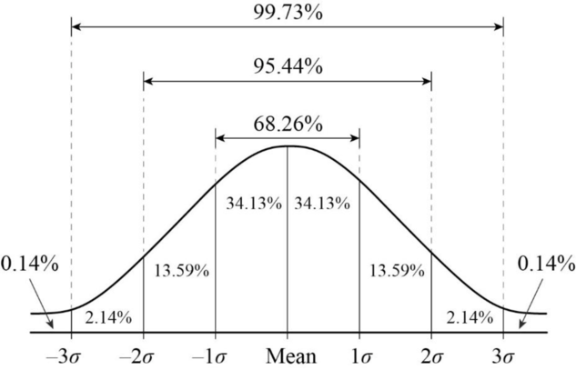
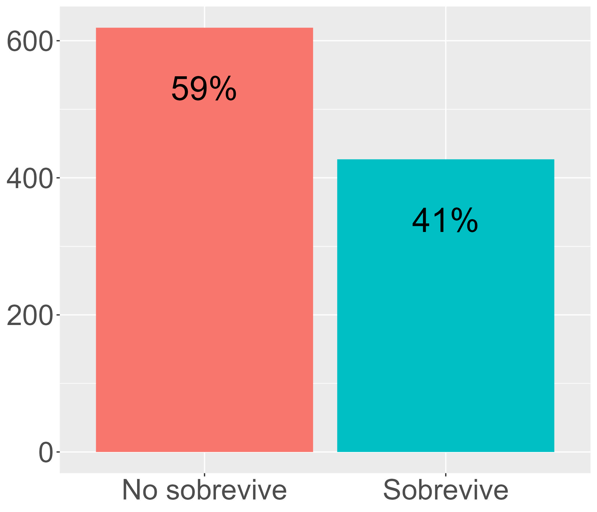
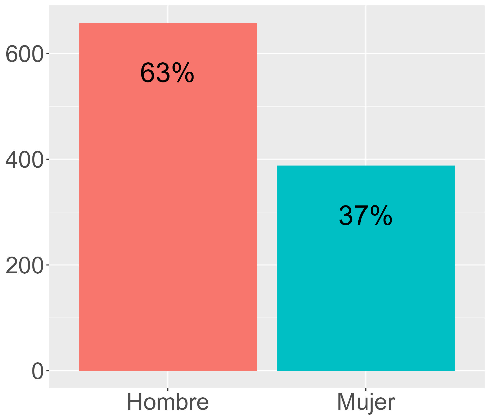
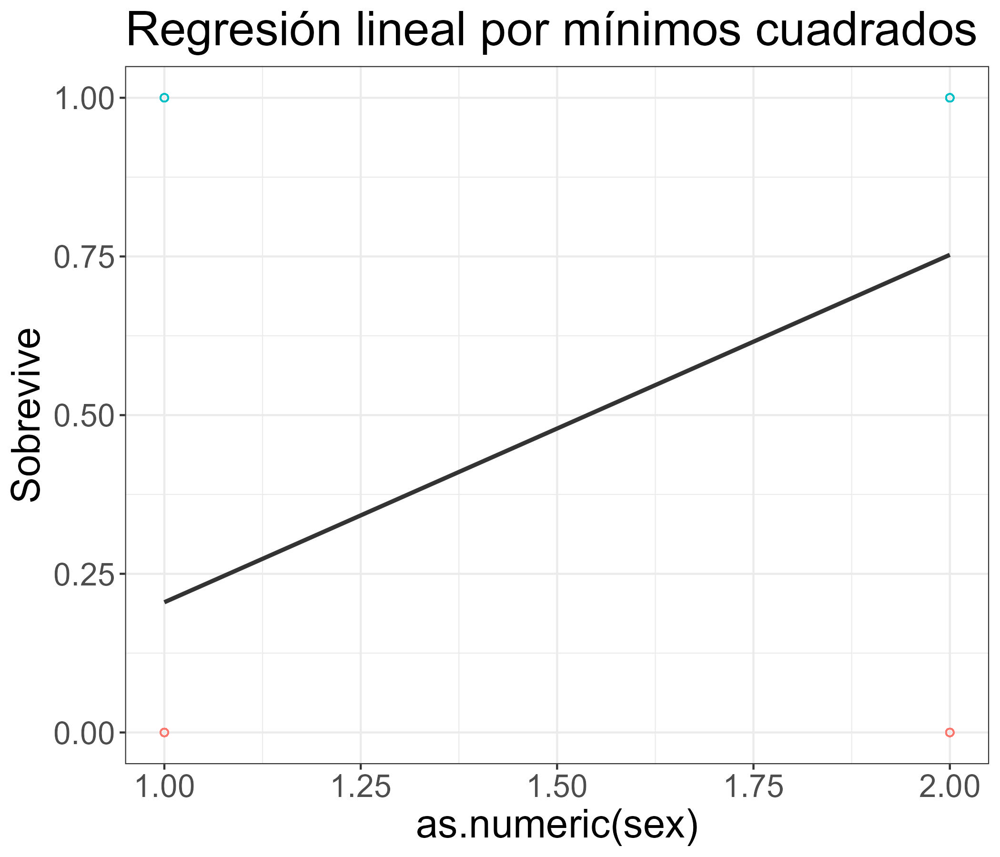
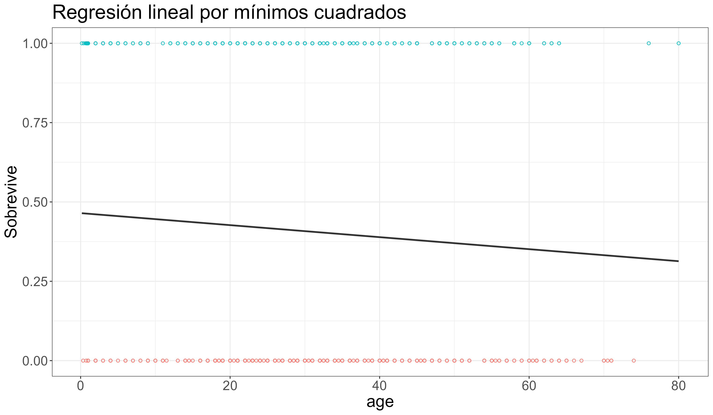
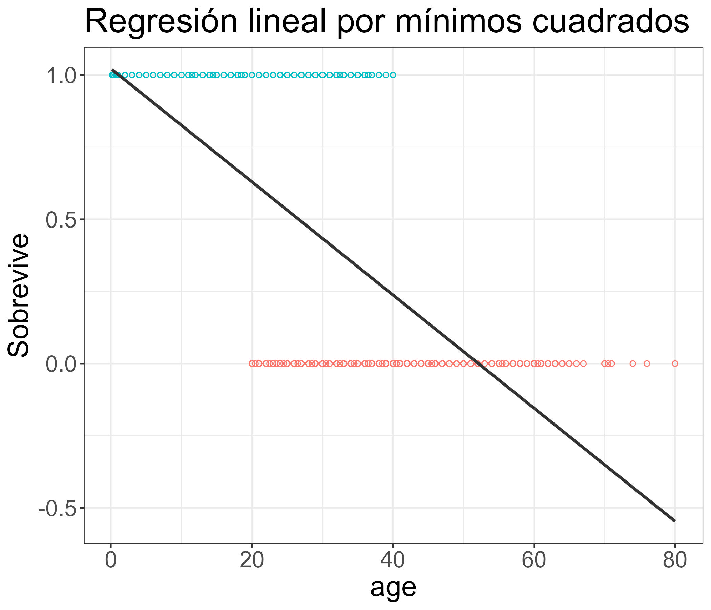
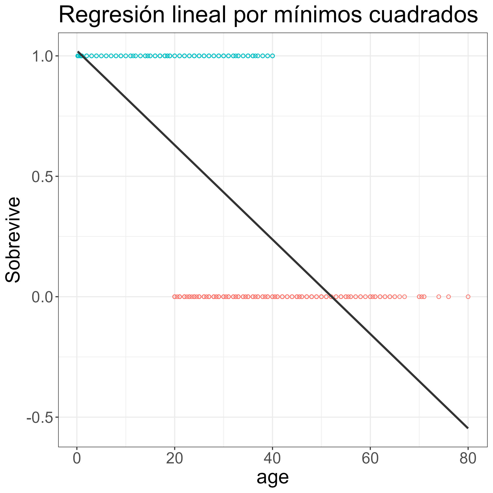
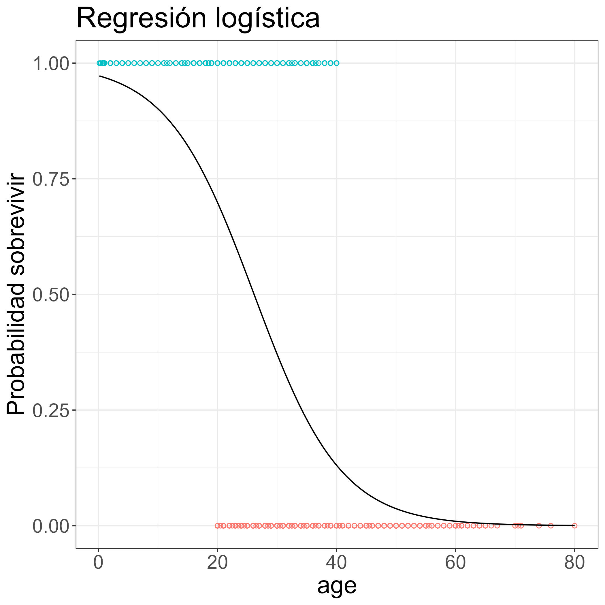
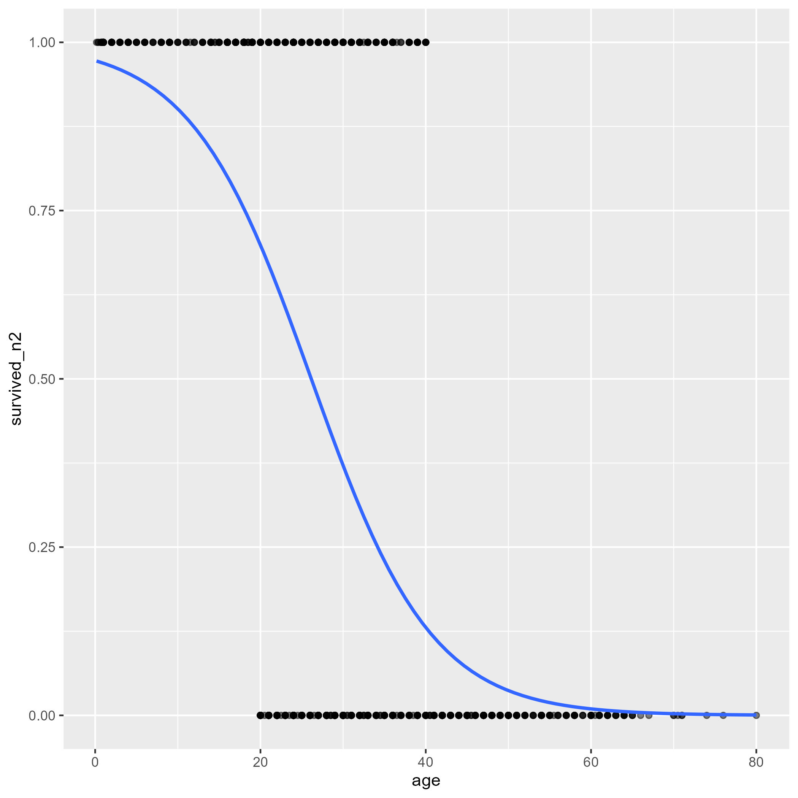

class: front


```{r eval=FALSE, include=FALSE}
# Correr esto para que funcione el infinite moonreader, el root folder debe ser static para si dirigir solo "bajndo" en directorios hacia el bib y otros

xaringan::inf_mr('/static/docpres/02_bases/2mlmbases.Rmd')

o en RStudio:
  - abrir desde carpeta root del proyecto
  - Addins-> infinite moon reader
```


```{r setup, include=FALSE, cache = FALSE}
require("knitr")
options(htmltools.dir.version = FALSE)
pacman::p_load(RefManageR)
# bib <- ReadBib("../../bib/electivomultinivel.bib", check = FALSE)
opts_chunk$set(warning=FALSE,
             message=FALSE,
             echo=FALSE,
             cache = FALSE #,fig.width=7, fig.height=5.2
             )
pacman::p_load(flipbookr, tidyverse)
```


```{r xaringanExtra, include=FALSE}
xaringanExtra::use_xaringan_extra(c("tile_view", "animate_css"))
xaringanExtra::use_scribble()
```

<!---
Para correr en ATOM
- open terminal, abrir R (simplemente, R y enter)
- rmarkdown::render('static/docpres/07_interacciones/7interacciones.Rmd', 'xaringan::moon_reader')

About macros.js: permite escalar las imágenes como [scale 50%](path to image), hay si que grabar ese archivo js en el directorio.
--->


.pull-left[
## Metodología Cuantitativa Avanzada
## **Kevin Carrasco**
## Magíster en ciencias sociales - Universidad de Chile
## 1er Sem 2025
## [.green[metod2-mcs.netlify.com]](https://metod2-mcs.netlify.com)
] 


.pull-right[
.right[
<br>
## .yellow[Sesión 9: Regresión logística]


]

]

---
class: inverse, bottom, right


# .red[Sesión 9]
<br>

.yellow[Repaso sesión anterior]

Introducción a regresión logística

Estimación de Regresión logística

<br>
<br>
<br>
<br>
---

layout: true
class: animated, fadeIn


---
# Conceptos centrales

- población - muestra

- parámetro - estadístico

- **error estándar**: permite expresar un rango de variación probable de un parámetro, con un cierto nivel de probabilidad

---
# Distribución normal



---
# Inferencia

- $H_0$: hipótesis nula (en general: no hay diferencias en la población)

- Establecer un nivel de significación $\alpha$, convencionalmente 0.05 o inferior para rechazar $H_0$ -> 95% de confianza

- Calcular error estándar 

- Calcular prueba estadística que permita relacionar el error estándar con los niveles de significación

---
# Inferencia en regresión

- Se calcula el error estándar del $\beta$

- Se divide el $\beta$ por el error estándar -> prueba $t$

- Se compara el $t$ con el $t_{crítico}$ en la tabla de valores $t$, asociada a un nivel de confianza y grados de libertad $n-k-1$

- Si $t$ > $t_{crítico}$ = se rechaza $H_0$ con una probabilidad de error _p_.

---
class: inverse, bottom, right


# .red[Sesión 9]
<br>

Repaso sesión anterior

.yellow[Introducción a regresión logística]

Estimación de Regresión logística

<br>
<br>
<br>
<br>
---
## Tipos de datos en relación a escalas de medición.

* *Datos categóricos*: pueden ser medidos sólo mediante escalas nominales, u ordinales en caso de orden de rango

* *Datos continuos*:
    - Medidos en escalas intervalares o de razón
    - Pueden ser transformados a datos categóricos

???
Conversión de continuo a categórico: estatura (cm) a categorías bajo – mediano – alto


---
class: inverse, center, bottom

.pull-left[

]

## ¿Se puede anticipar el final?

???

Si vas al cine a ver esta película, y si antes conoces los datos sobre el Titanic, puedes anticipar el final?

---
# Titanic data


```{r echo=FALSE}
pacman::p_load(sjmisc, descr, scales, xtable, ggmosaic, stargazer, summarytools, sjPlot, dplyr)

load("titanic.Rdata")

```

.small[

```{r echo=FALSE}
tt2 <- tt %>% select(survived,sex,age )  
print(dfSummary(tt2, headings = FALSE), method = "render")
```
]

---
# Sobrevivientes
.pull-left[
.small[

```{r, echo=TRUE, fig.height=6}

plot1 <-ggplot(tt, 
     aes(survived, fill=survived)) + 
  geom_bar() + 
  geom_text(
     aes(label = scales::percent((..count..)/sum(..count..))),
     stat='count',size=10, vjust = 3) + 
  theme(legend.position="none", 
        text = element_text(size = 30),
        axis.title=element_blank())

ggsave(plot1, file="../../files/img/sobrevivientes.jpg")
```
]
]
.pull-right[



]

---
# Sexo

.center[
```{r, echo=FALSE, fig.height=6}
plot2<-ggplot(tt, aes(sex, fill=sex)) + 
  geom_bar() + 
  geom_text(aes(label = scales::percent((..count..)/sum(..count..))),
     stat='count',
     size=10,
     vjust = 3) + 
  theme(legend.position="none", text = element_text(size = 30),axis.title=element_blank())
ggsave(plot2, file="../../files/img/sexo.jpg")
```

]
---
## Sobrevivencia / sexo

.pull-left[

]


.pull-right[
.medium[
```{r message=FALSE,warning=FALSE}
round(prop.table(table(tt$survived,tt$sex),2),2)
```
El 75% de las mujeres sobrevive, mientras el 25% no sobrevive.
]
]

---
class: inverse, middle, center

## ¿En qué medida la probabilidad de sobrevivir depende del sexo?

## ¿Es esta probabilidad estadísticamente significativa?

---
# Alternativas:

- tabla de contingencia, $\chi^2$

  - análisis de tendencia general, significación estadística
  - pero ... poco parsimoniosa, y no hay control estadístico
  
- ¿Aprovechar las ventajas del modelo de regresión?
  - expresar la relación en un número ( $\beta$ )
  - inferencia
  - control estadístico (parcialización)

---
# Regresión

### Modelando la probabilidad de sobrevivir con regresión OLS

```{r echo=FALSE, results='hide'}
# Generar dummy sexo
str(tt$sex)

# tt$sex_f<-tt$sex

#str(tt$sex_f)

# tt <- tt %>% mutate(sex=recode(sex, "Hombre"=0, "Mujer"=1), label="Mujer")
#str(tt$sex)
```

.small[
```{r warning=TRUE, echo=TRUE}
reg_tit=lm(survived ~ sex, data= tt)
```

]


-> Advertencia de R

---
## Modelo de probabilidad lineal

.pull-left[
.small[
Se da este nombre a los modelos de regresión donde una variable dependiente dicotómica se estima de manera tradicional (mínimos cuadrados ordinarios)

```{r echo=TRUE}
str(tt$survived)
tt <- tt %>% mutate(survived_n=recode(survived,
"No sobrevive"=0, "Sobrevive"=1))
str(tt$survived_n)

```
]
]

.pull-right[
.small[

```{r echo=TRUE}
reg_tit=lm(survived_n ~ sex, data=tt)
```


```{r results='asis', echo=FALSE}
sjPlot::tab_model(reg_tit,
        show.se=TRUE,
        show.ci=FALSE,
        digits=3,
        p.style = "stars",
        dv.labels = c("Modelo 1"),
        string.pred = "Predictores",
        string.est = "β")
```
]
]

---
## Significado coeficientes modelo probabilidad lineal

.pull-left[
**Promedio de supervivencia por sexo**
```{r results='asis', echo=FALSE}
print(xtable(compmeans(tt$survived_n,tt$sex, plot=FALSE), digits=c(0,3,0,2)),type="html")
```
]

.pull-right[
- El valor del intercepto=0.205 (0.21 aproximado) es el valor predicho para la categoría de referencia "hombre".

- El $\beta$ de sexo (mujer) =0.547 sumado al intercepto equivale al porcentaje de supervivencia de mujeres]

---
class: roja, middle

# funciona ... .yellow[PERO]

---
## Limitaciones modelo de regresión lineal para dependientes dicotómicas

.center[
```{r echo=FALSE,fig.height=6}
plot3<-ggplot(data = tt, aes(x = as.numeric(sex), y = survived_n)) +
  geom_point(aes(color = as.factor(survived_n)), shape = 1) +
  geom_smooth(method = "lm", color = "gray20", se = FALSE) +
  theme_bw()  +
  labs(title = "Regresión lineal por mínimos cuadrados",
       y = "Sobrevive") +
  theme(legend.position = "none", text = element_text(size = 20))
ggsave(plot3, file="../../files/img/limitacion1.jpg")
```

]

---
## Problemas ....
.center[
```{r echo=FALSE,fig.width=12, fig.height=7}
plot4<-ggplot(data = tt, aes(x = age, y = survived_n)) +
  geom_point(aes(color = as.factor(survived_n)), shape = 1) +
  geom_smooth(method = "lm", color = "gray20", se = FALSE) +
  theme_bw()  +
  labs(title = "Regresión lineal por mínimos cuadrados",
       y = "Sobrevive") +
  theme(legend.position = "none", text = element_text(size = 20))
ggsave(plot4, file="../../files/img/limitacion2.jpg")
```

]

---
# Problemas ...

.pull-left[
Si hubieran sobrevivido todos los menores de 20 y muerto todos los mayores de 40 ...
```{r echo=FALSE}
tt$survived_n2 <-tt$survived_n
tt$survived_n2[tt$age>40]<-0
tt$survived_n2[tt$age<20]<-1
```
]

.pull-right[
```{r echo=FALSE, fig.height=6}
plot5<-ggplot(data = tt, aes(x = age, y = survived_n2)) +
  geom_point(aes(color = as.factor(survived_n2)), shape = 1) +
  geom_smooth(method = "lm", color = "gray20", se = FALSE) +
  theme_bw()  +
  labs(title = "Regresión lineal por mínimos cuadrados",
       y = "Sobrevive") +
theme(legend.position = "none", text = element_text(size = 20))
ggsave(plot5, file="../../files/img/limitacion3.jpg")
```

]


---
class: inverse

## Problemas regresión tradicional (OLS) para dependientes dicotómicas

- ### Eventuales predicciones fuera del rango de probabilidades posibles
- ### Ajuste a los datos / residuos: ¿Es la mejor aproximación una recta?

---
class: roja, right

## La regresión .yellow[logística] ofrece una solución a los problemas del rango de predicciones y de ajuste a los datos del modelo de probabilidad lineal

--

## Se logra mediante una _transformación_ de lo(s) beta(s)  a .yellow[coeficientes  *LOGIT*]
]

---
class: middle center


---
## OLS vs Logit

.pull-left[
```{r echo=FALSE}
plot6<-ggplot(data = tt, aes(x = age, y = survived_n2)) +
  geom_point(aes(color = as.factor(survived_n2)), shape = 1) +
  geom_smooth(method = "lm", color = "gray20", se = FALSE) +
  theme_bw()  +
  labs(title = "Regresión lineal por mínimos cuadrados",
       y = "Sobrevive") +
  theme(legend.position = "none", text = element_text(size = 20))
ggsave(plot6, file="../../files/img/logit.jpg")
```

]

.pull-right[

```{r, echo=FALSE}
modelo_logistico2 <- glm(survived_n2 ~ age, data = tt, family = "binomial")
```

```{r echo=FALSE}
plot7<-ggplot(data = tt, aes(x = age, y = survived_n2)) +
  geom_point(aes(color = as.factor(survived_n2)), shape = 1) +
  stat_function(fun = function(x){predict(modelo_logistico2,
                                          newdata = data.frame(age = x),
                                          type = "response")}) +
  theme_bw() +
  labs(title = "Regresión logística",
       y = "Probabilidad sobrevivir") +
  theme(legend.position = "none", text = element_text(size = 20))

ggsave(plot7, file="../../files/img/ols.jpg")
```

]


---
# ¿Qué es el logit?

--


## Es el logaritmo de los odds

--

# ... qué son los odds?

--

## Una razón de *probabilidades*


--
## Para llegar hasta regresión logística, hay que pasar por los odds (chances), y los odds-ratio (proporción de chances)

---
# Odds 

- **odds** (chances): probabilidad de que algo ocurra dividido por la probabilidad de que no ocurra

$$Odds=\frac{p}{1-p}$$

--

.medium[
Ej. Titanic:
  - 427 sobrevivientes (41%), 619 muertos (59%)
$$Odds_{sobrevivir}=427/619=0.41/0.59=0.69$$

.center[**Es decir, las chances de sobrevivir son de 0.69**]

]
---
# Odds

- Odds de 1 significan chances iguales, menores a 1 son negativas y mayores a 1 son positivas

- _Propiedad simétrica_: 
  - un $Odd=4$ es una asociación positiva proporcional a la asociación negativa $Odd=1/4=0.25$

---
.pull-left[
## Odds de superviviencia para los hombres
.medium[
```{r message=FALSE,warning=FALSE}
table(tt$survived,tt$sex)
```
]

.medium[
```{r message=FALSE,warning=FALSE}
round(prop.table(table(tt$survived,tt$sex),2),2)
```
El 21% de los hombres sobrevive mientras el 79% no sobrevive.
]
]
--
.pull-right[
.medium[

$$Odds_{hombres}=\frac{0.21}{0.79}=0.27$$

*La probabilidad de sobrevivencia en los hombres es 0.27 veces a la no sobrevivencia*

... o en otros términos

*Hay 0.27 hombres que sobreviven por cada uno que no sobrevive*

*Hay 27 hombres que sobreviven por cada 100 hombres que no sobreviven*
]
]

---
## Odds de superviviencia para las mujeres

.pull-left[
.medium[
```{r message=FALSE,warning=FALSE}
round(prop.table(table(tt$survived,tt$sex),2),2)
```
El 75% de las mujeres sobrevive, mientras el 25% no sobrevive.


]
]
--
.pull-right[
.medium[
$$Odds_{mujeres}=\frac{0.75}{0.25}=3$$
*La probabilidad de sobrevivencia en las mujeres es 3 veces a la no sobrevivencia*


*Hay 3 mujeres que sobreviven por cada mujer que no sobrevive*

o en otros términos

*Hay 300 mujeres que sobreviven al titanic por cada 100 mujeres que no sobreviven*
]
]


---
## Odds ratio (OR)

.pull-left[
- los odds-ratio (o razón de chances) permiten reflejar la asociación entre las chances de dos variables dicotómicas


**¿Tienen las mujeres más chances de sobrevivir que los hombres?**
]

--
.pull-right[
.medium[
```{r}
sjt.xtab(tt$survived, tt$sex,
        show.col.prc=TRUE,
        show.summary=FALSE
)
```
]
]

---
# Odds Ratio

**¿Cuantas más chances de sobrevivir tienen las mujeres respecto de los hombres?**

- OR supervivencia mujeres / OR supervivencia hombres

.medium[
$$OR=\frac{p_{m}/(1-p_{m})}{p_{h}/(1-p_{h})}=\frac{0.753/(1-0.753)}{0.205/(1-0.205)}=\frac{3.032}{0.257}=11.78$$
]

--

### Las chances de sobrevivir de las mujeres son **11.78** veces más que las de los hombres.

---
class: inverse, middle, center

## El Odds-Ratio (OR) nos permite expresar **en un número** la relación entre dos variables categóricas

## Por lo tanto, es una versión del $\beta$ para dependientes categóricas


---
class: inverse, middle, center

## Pero ... el **OR** tiene algunas limitaciones que requieren una transformación adicional


---
class: inverse, bottom, right


# .red[Sesión 9]
<br>

Repaso sesión anterior

Introducción a regresión logística

.yellow[Estimación de Regresión logística]

<br>
<br>
<br>
<br>

---
# Regresión logística y odds


.pull-left[
```{r echo=FALSE}
plot8<-ggplot(data = tt, aes(x = age, y = survived_n2)) +
  geom_point(aes(color = as.factor(survived_n2)), shape = 1) +
  stat_function(fun = function(x){predict(modelo_logistico2,
                                          newdata = data.frame(age = x),
                                          type = "response")}) +
  theme_bw() +
  labs(title = "Regresión logística",
       y = "Probabilidad sobrevivir") +
  theme(legend.position = "none", text = element_text(size = 20))

ggsave(plot8, file="../../files/img/logistica.jpg")
```

]


.pull-right[
Una de las transformaciones que permite realizar una estimación de regresión con variables dependientes dicotómicas es el **logit**, que es logaritmo de los odds.
]

---
# Logit

$$Logit=ln(Odd)=ln(\frac{p}{1-p})$$
---
.small[

.pull-left[
## Probabilidades, odds y logit

]

.pull-right[


```{r, echo=FALSE}

df <- data.frame(matrix(ncol = 3, nrow = 19)) 
x <- c("prob", "odds", "logit") 
colnames(df) <- x
df[is.na(df)] = " "
df$prob <- seq(0.001,0.999, length.out = 19)
print(df, digits = 3,row.names = FALSE)

```


]
]

---
.small[

.pull-left[
## Probabilidades, odds y logit

```{r eval=FALSE, echo=TRUE}

df$odds <- df$prob/(1-df$prob)

df$logit <- log(df$odds)
```


]

.pull-right[


```{r, echo=FALSE}

df <- data.frame(matrix(ncol = 3, nrow = 19)) 
x <- c("prob", "odds", "logit") 
colnames(df) <- x
df[is.na(df)] = " "
df$prob <- seq(0.001,0.999, length.out = 19)
df$odds <- df$prob/(1-df$prob)
df$logit <- log(df$odds)
print(df, digits = 3,row.names = FALSE)

```


]
]

---
.small[

.pull-left[
## Probabilidades, odds y logit

```{r eval=FALSE, echo=TRUE}

df$odds <- df$prob/(1-df$prob)

df$logit <- log(df$odds)
```


]

.pull-right[


```{r, echo=TRUE, eval=FALSE}
##    prob     odds  logit
##  0.0010   0.0010 -6.907
##  0.0564   0.0598 -2.816
##  0.1119   0.1260 -2.072
##  0.1673   0.2010 -1.605
##  0.2228   0.2866 -1.250
##  0.2782   0.3855 -0.953
##  0.3337   0.5008 -0.692
##  0.3891   0.6370 -0.451
##  0.4446   0.8004 -0.223
*##  0.5000   1.0000  0.000
##  0.5554   1.2494  0.223
##  0.6109   1.5700  0.451
##  0.6663   1.9970  0.692
##  0.7218   2.5942  0.953
##  0.7772   3.4888  1.250
##  0.8327   4.9761  1.605
##  0.8881   7.9374  2.072
##  0.9436  16.7165  2.816
##  0.9990 999.0000  6.907
```


]
]

---
.small[

.pull-left[
## Probabilidades, odds y logit

```{r eval=FALSE, echo=TRUE}

df$odds <- df$prob/(1-df$prob)

df$logit <- log(df$odds)
```


]

.pull-right[


```{r, echo=TRUE, eval=FALSE}
##    prob     odds  logit
*##  0.0010   0.0010 -6.907
##  0.0564   0.0598 -2.816
##  0.1119   0.1260 -2.072
##  0.1673   0.2010 -1.605
##  0.2228   0.2866 -1.250
##  0.2782   0.3855 -0.953
##  0.3337   0.5008 -0.692
##  0.3891   0.6370 -0.451
##  0.4446   0.8004 -0.223
*##  0.5000   1.0000  0.000
##  0.5554   1.2494  0.223
##  0.6109   1.5700  0.451
##  0.6663   1.9970  0.692
##  0.7218   2.5942  0.953
##  0.7772   3.4888  1.250
##  0.8327   4.9761  1.605
##  0.8881   7.9374  2.072
##  0.9436  16.7165  2.816
*##  0.9990 999.0000  6.907
```


]
]


---
# Estimación en R: `glm`

```
modelo <- glm(dependiente ~ indep 1 + indep2 + ...,
          data=datos,
          family="binomial")
```

- `glm` (general lineal model) es la función para variables dependientes categóricas


- `family="binomial"` indica que la dependiente es dicotómica


---
# Ejemplo Titanic

.pull-left[

```{r echo=TRUE}
modelo_titanic <-
glm(survived ~ sex,
data = tt,
family = "binomial")

```

]

.pull-right[.small[

```{r results='asis', echo=FALSE}

# Para crear un modelo con OR y agregar a la tabla // luego no funciona (?)
or <- texreg::extract(modelo_titanic)
or@coef <- exp(or@coef)
or@se <- numeric()

texreg::htmlreg(list(modelo_titanic,or ), doctype = FALSE, caption=" ", custom.coef.names = c("Intercepto", "Mujer (Ref=Hombre)"), custom.model.names = c("Logit", "OR"), digits = 3)
```

]
]


---
## Interpretación de asociaciones y contraste de hipótesis

### - Coeficiente logit asociado a sexo (mujer) = +2.467 :

  - El log-odds de sobrevivencia aumenta para las mujeres en 2.467 en comparación con los hombres. 

--

### Contraste de hipótesis

- La diferencia de las probabilidades de sobrevivir entre hombres y mujeres son estadísticamente significativas, por lo que se rechaza la hipótesis nula (de ausencia de diferencias entre hombres y mujeres) con un nivel de probabilidad $p<0.001$.


---
## Interpretación de coeficientes logit


- Sustantivamente no nos dice mucho, ya que el logit es una transformación de la escala original.

- Por lo tanto, para poder interpretar el sentido del coeficiente se requiere volver a la métrica de odds mediante una transformación inversa o **exponenciación**


---
## De logits a odds 

.pull-left[
$$logit_x=log(Odds)$$
$$e^{logit}=Odds_X$$
$$e^{2.467}=11.78$$
]

.pull-right[
```{r echo=TRUE}
exp(2.467)
```
### Las chances (odds) de sobrevivir siendo mujer son **11.78** veces más que las de un hombre. 
]

---
## De logits a odds

$$Odds_X=e^{\beta_0 + \beta_jX_j}$$
<br>
--
- Predicción para **mujeres**= -1.354 + (2.467 * Sexo=1) = 1.113

-  Predicción para **hombres**= -1.354 + (2.467 * Sexo=0) = -1.354

--

<br>

$$Odds_{mujer}=e^{1.113}=3.032$$
$$Odds_{hombre}=e^{-1.354}=0.257$$

---
## Transformación a probabilidades predichas

$$p_{mujeres}=\frac{e^{1.113}}{1+e^{1.113}}=\frac{3.04}{4.04}=0.752$$
$$p_{hombres}=\frac{e^{-1.354}}{1+e^{-1.354}}=\frac{0.258}{1.258}=0.205$$

---
## Regresión logística simple para independientes continuas

.pull-left[

```{r echo=TRUE}
modelo_titanic_age <-
glm(survived ~ age,
data = tt,
family = "binomial")

```

]

.pull-right[.small[

```{r results='asis', echo=FALSE}

# Para crear un modelo con OR y agregar a la tabla // luego no funciona (?)
or <- texreg::extract(modelo_titanic_age)
or@coef <- exp(or@coef)
or@se <- numeric()

texreg::htmlreg(list(modelo_titanic_age,or ), doctype = FALSE, caption=" ", custom.coef.names = c("Intercepto", "Edad"), custom.model.names = c("Logit", "OR"), digits = 3)
```

]
]


---
## Plot probabilidades predichas

.center[

```{r}
plot9<-ggplot(tt, aes(x=age, y=survived_n2)) + 
  geom_point(alpha=.5) +
  stat_smooth(method="glm", se=FALSE, method.args = list(family=binomial))
ggsave(plot9, file="../../files/img/predichas.jpg")
```


]


---
# Regresión logística multiple

.pull-left[

```{r echo=TRUE}
modelo_titanic2 <-
glm(survived ~ sex + age,
data = tt,
family = "binomial")
```

]

.pull-right[.small[

```{r results='asis', echo=FALSE}
or2 <- texreg::extract(modelo_titanic2)
or2@coef <- exp(or2@coef)
or2@se <- numeric()

texreg::htmlreg(list(modelo_titanic2,or2 ), doctype = FALSE, caption=" ", custom.coef.names = c("Intercepto", "Mujer (Ref=Hombre)", "Edad"),        custom.model.names = c("Logit", "OR"))
```

]
]


---
class: inverse

### Resumen

- regresión logística: ajusta el modelo para dependientes dicotómicas

- requiere de ajustes y transformaciones para que la estimación tenga sentido

- pasa por el cálculo de los odds-ratio, que resumen en 1 número la relación entre dos variables categóricas

- En regresión logística la interpretación sustantiva de coeficientes se realiza con los odds-ratio (exponenciando los coeficientes logit)


---
class: front

.pull-left[
## Metodología Cuantitativa Avanzada
## **Kevin Carrasco**
## Magíster en ciencias sociales - Universidad de Chile
## 1er Sem 2025
## [.green[metod2-mcs.netlify.com]](https://metod2-mcs.netlify.com)
] 


.pull-right[
.right[
<br>
## .yellow[Sesión 9: Regresión logística]


]

]
